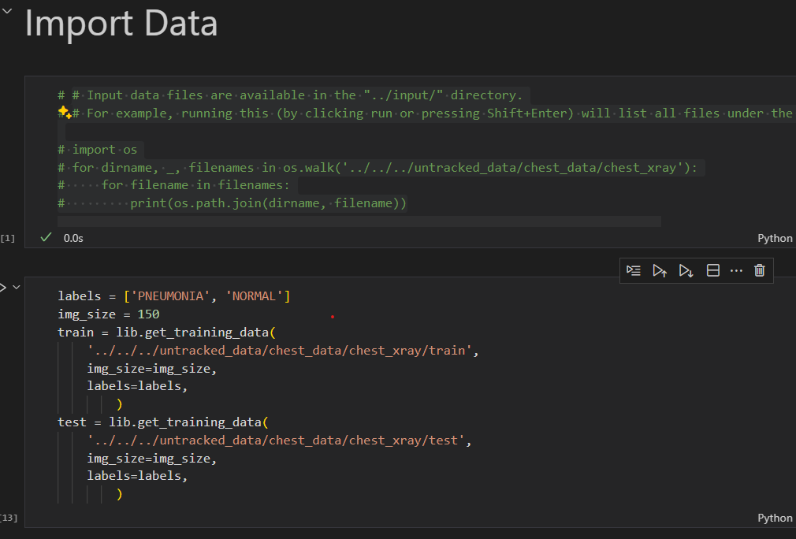
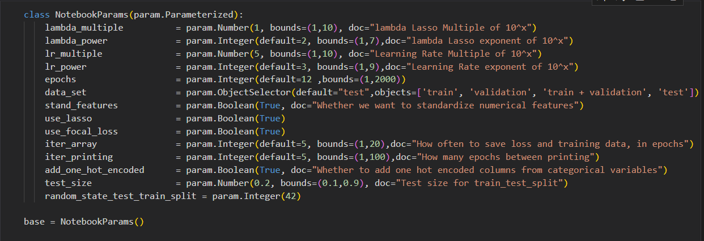

# Project 1: Interpretable and Explainable Classification for Medical Data

## Notebooks by questions

###  Heart Disease

*  **Q1, Q2**: [Heart_explo_and Logistic](https://github.com/juliepinole/eth/blob/main/healthcare/heart/Heart_explo_and%20Logistic.ipynb)
*  **Q3**: [Heart_MLP](https://github.com/juliepinole/eth/blob/main/healthcare/heart/Heart_MLP.ipynb)
*  **Q4**: [Heart_explo_NAM](https://github.com/juliepinole/eth/blob/main/healthcare/heart/Heart_explo_NAM.ipynb)
###  Chest Xrays
*  **Q1, Q2**: [Chest_explo_and_cnn](https://github.com/juliepinole/eth/blob/main/healthcare/chest/Chest_explo_and_cnn.ipynb)
*  **Q3, Q4**: [Chest_interpretability](https://github.com/juliepinole/eth/blob/main/healthcare/chest/Chest_interpretability.ipynb)

## Data import in notebooks

* **Heart Disease**: there is no action required, the relevant csv files are in the same folder as the notebookds and are imported through pd.read_csv().
* **Chest Xrays**: [ACTION REQUIRED]. The path to the data have to be filled as the first argument of the function lib.get_training_data() as in orange in the image below:

Data folders need to have the same structure as in the initial dataset. From the path filled above, two folders need to be present:

*  PNEUMONIA: with the examples of xrays from patients suffering from pneumonia.
*  NORMAL: with the examples of xrays from healthy patients.

## Parameters

Each notebook has a cell declaring a class of parameters (see image below), which are then potentially called and changed across the notebook. 

I have set the default value of the parameters to the value that I used eventually, so in principle no change of parameter is needed at all, but if need be, parameters changes can be performed easily. See example:

